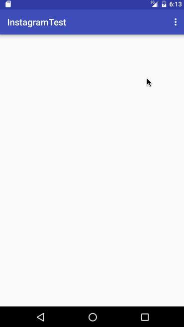

##Demo

### Ngày 8.6.2016

1. Đã làm được
  - Tìm hiểu về Retrofit
  - Tìm hiểu về MVP
  - Tìm hiểu Material design
  - Tìm hiểu về TheMoviesDb API
  - Áp dụng MVP và sử dụng Retrofit để làm demo một app lấy danh sách các phim đang được chiếu.

2. Sẽ làm tiếp theo
  - Đọc thêm về MVP
  - Đọc thêm về Material Design
  - Tìm hiểu Instagram API
  - Demo pick image từ Instagram
  - Pick Image từ Photo library trên máy
  - Expanable listview (Không biết có nên dùng library ngoài không?)

3. Những rắc rối gặp phải

### Ngày 9.6.2016

1. Đã làm được
  - Fix lại các lỗi của issue 1
  - Tìm hiểu thêm về MVP
  - Tìm hiểu thêm về Material Design
  - Tìm hiểu Instagram API
  - Tìm hiểu về OAuth 2.0
  - Làm app lấy hình ảnh từ Instagram

2. Sẽ làm tiếp theo
  - Pick Image từ Photo library trên máy
  - Pick Image từ camera
  - Hoàn thiện thêm về giao diện
 
 3. Những rắc rối gặp phải
  - Parse JSON khi 1 property của class là 1 class khác
